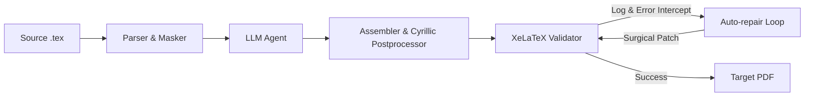

# Osanwe

Autonomous multi-agent translation engine for arXiv papers that translates academic LaTeX into publication-ready Russian while strictly preserving mathematical syntax, complex environments, and styling.

---

## 📌 What is it

Standard LLMs corrupt LaTeX syntax when translating full papers: they drop escapes, hallucinate math environments, distort TikZ diagrams, and break fragile cross-references, leading to non-compiling documents. 

**Osanwe** solves this by decoupling structural parsing from translation, isolating equations and code environments via token masking, and running an autonomous **closed-loop error repair cycle** driven by compiler diagnostic logs.

---

## 🚀 Key Features

* **Compiler-Driven Auto-Repair Loop:** Intercepts `stderr` and compilation logs from XeLaTeX/pdflatex, localizes syntax and macro conflicts, and autonomously applies surgical patches to `.tex` and `.sty` files until the build succeeds.
* **Math & Syntax Masking:** Isolates inline/display math (`$`, `$$`, `\begin{equation}`, `align`), TikZ figures, citations, and custom macros into immutable tokens before prompt dispatch.
* **AST-Aware Semantic Chunking:** Splits documents along structural boundaries (sections, paragraphs, tables) to maintain contextual coherence and stay within LLM context budgets.
* **Prompt Caching & Cost Efficiency:** Structured system prompts and context compression reduce OpenAI API token overhead by ~35%.
* **Extensible Ecosystem:** CLI entry point for batch processing, alongside optional Notion database sync and Discord bot interfaces.

---

## 🏗 Architecture / Pipeline



```
Source .tex ──► Parser & Masker ──► LLM Agent ──► Postprocessor ──► XeLaTeX Validator ──► Target PDF
                                                                            │
                                                                    Auto-repair Loop
                                                                     (compiler logs)
```

---

## 🧪 Tests

The core pipeline (masking, parsing, chunk splitting, postprocessing, compiler diagnostic parsing, Notion upload) is covered by unit and integration suites:

```bash
# Run pytest suite (56 passed)
pytest -v

# Run offline regression replay (using cached arXiv fixtures)
python3 tests/regression_runner.py --tier smoke
```

---

## ⚡ Quick Start

```bash
# 1. Clone & install dependencies
git clone https://github.com/m3nandros/osanwe.git
cd osanwe
python3 -m venv venv
source venv/bin/activate
pip install -r requirements.txt

# 2. Configure environment
cp .env.example .env
# Add your OPENAI_API_KEY in .env

# 3. Translate an arXiv paper
python3 cli.py 1706.03762
```

Outputs and compiled PDFs are generated in `temp/<id>/source/translated.pdf`. Sample articles and translation outputs are available in `examples/`.
